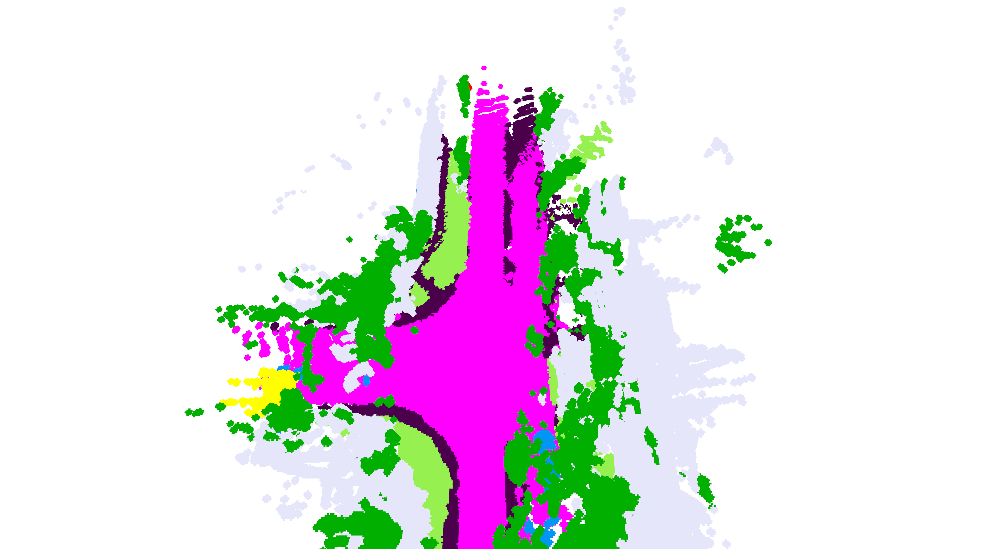

# TT-Occ: Test-Time Compute for Self-Supervised Occupancy
Why train a dedicated occupancy network in the era of foundation VLMs?
We show that a test-time occupancy framework that integreted with a conmbination of VLMs could achieve SOTA performance **without any training or fine-tuning**.

## 🚩 Timeline
* **`11 Mar 2025`**: Paper released on [Arxiv](https://arxiv.org/pdf/2503.08485).
* **`02 July 2025`**: Initial code release:
  * **Variants:**
    * [x] TT-OccLiDAR
    * [x] TT-OccCamera
  * **Datasets Supported:**

    * [x] [Occ3D-nuScenes](https://github.com/Tsinghua-MARS-Lab/Occ3D?tab=readme-ov-file#occ3d-nuScenes)
    * [x] [nuCraft](https://github.com/V2AI/nuCraft_API)
  * **Depth Modules:**

    * [x] [VGGT](https://github.com/facebookresearch/vggt)
    * [x] [R3D3](https://github.com/SysCV/r3d3)
  * **Semantic Modules:**

    * [x] [OpenSeeD](https://github.com/IDEA-Research/OpenSeeD)
    * [ ] [Grounded-SAM](https://github.com/IDEA-Research/Grounded-Segment-Anything)
  * **Flow Modules:**

    * [x] [RAFT](https://github.com/princeton-vl/RAFT)

> TT-Occ easily integrates advanced VLMs through a simple adapter interface. Contributions are warmly welcomed!

## 📥 Data Preparation

1. Download the nuScenes dataset from [nuScenes.org](https://www.nuscenes.org/download).
2. Extract nuScenes data into a readable format:
   ```bash
   python extract_nuscenes.py  # Ensure you set your dataset path inside this script.
   ```
3. Download ground-truth occupancy labels:
   * Occ3D-nuScenes GT: [Google Drive](https://drive.google.com/drive/folders/1Xarc91cNCNN3h8Vum-REbI-f0UlSf5Fc)
   * nuCraft GT: [nuCraft GitHub](https://github.com/V2AI/nuCraft_API?tab=readme-ov-file)
4. Update dataset paths in all `run_xx.sh`.

## 🌱 Environment Setup
For the external repositories used in this project, we provide minimal versions of their codebases under the `submodule` directory. These have been packaged and installed within a unified conda environment, so you do not need to clone or install each dependency separately. Please reproduce our environment and download checkpoints via:

```bash
conda env create -f environment.yml
conda activate ttocc
bash submodules/install_and_download.sh
```

⚠️ **Special Case:**
Due to dependency conflicts, **OpenSeeD** requires a separate environment.
Follow instructions at [OpenSeeD Installation Guide](https://github.com/IDEA-Research/OpenSeeD).

## 🔧 Data Preprocessing

Extract semantic features with OpenSeeD:

```bash
conda activate openseed
bash run_openseed.sh 
```

This generates `openseed_x` directories under your data folder.

**Optional (Recommended for TT-OccCamera):**
Pre-compute depth and optical flow to reduce GPU usage and loading time at runtime:

```bash
conda activate ttocc
bash run_vggt.sh
bash run_raft.sh
```

These scripts generate `vggt_x` and `raft_x` folders under the data directory.
If skipped, depth and flow are computed at runtime by calling VLM modules (requires more GPU memory).

## 🚀 Running TT-Occ

Evaluate on the complete 150-scene test split for both Occ3D-nuScenes and nuCraft:

```bash
conda activate ttocc
bash run_main.sh
```

Results will be saved to `out-main-xx` folders and summarized in `result.json`, matching paper-reported metrics.

### 🎨 Visualization

We provide a simple occupancy visualizer based on **Open3D**.
To visualize occupancy predictions, run:

```bash
python vis.py  # Make sure the dataset path is correctly set.
```

Example visualization outputs:

* **TT-OccLiDAR:**
  

* **TT-OccCamera:**
  

For advanced visualization commands, refer to `custom_utils/VoxelGridVisualizer`.


## 📌 Acknowledgements

This project builds upon the excellent codebase of [3DGS](https://github.com/graphdeco-inria/gaussian-splatting) and powerful VLMs including [OpenSeeD](https://github.com/IDEA-Research/OpenSeeD), [VGGT](https://github.com/facebookresearch/vggt), [RAFT](https://github.com/princeton-vl/RAFT), etc.
We deeply appreciate their creators' efforts and your interest in TT-Occ!

## 📖 Citation

If you find this work helpful, please star our repo and cite the paper:

```bibtex
@misc{zhang2025ttocctesttimecomputeselfsupervised,
  title={TT-Occ: Test-Time Compute for Self-Supervised Occupancy via Spatio-Temporal Gaussian Splatting}, 
  author={Fengyi Zhang and Huitong Yang and Zheng Zhang and Zi Huang and Yadan Luo},
  year={2025},
  eprint={2503.08485},
  archivePrefix={arXiv},
  primaryClass={cs.CV},
  url={https://arxiv.org/abs/2503.08485}, 
}
```


- Proj
  - main.py
  - scene
    - datareader.py
  - submodules
    - raft
      - main.py
      - core
        - utils.py

