# TT-Occ: Test-Time Compute for Self-Supervised Occupancy

## 📕 Background
- **Supervised** occupancy network typically requires **dense 3D annotations** obtained through labor-intensive manual labeling of dynamic driving scenes spanning up to 80 meters per frame.
- **Previous self-supervised** occupancy network
  - requires substantial training (hundreds of GPU hours for low-resolution)
  - once trained, hard to adapt to different resolutions or novel object classes beyond the predefined ones.

⁉️ **Why train a dedicated occupancy network in the era of foundation VLMs?**
We show that a test-time occupancy framework that integreted with a conmbination of VLMs could achieve SOTA performance **without any network training or fine-tuning**.
## 🌎 Overview
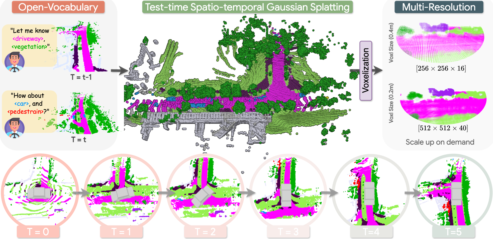

### 💪 Our system is
- **Training-Free**: Achieves SOTA performance without any network training or fine-tuning.

- **Spatially Consistent**: Effectively accumulates temporal information and handles dynamic regions.

- **Scalable**: Automatically benefits from advancements in VLMs through a loosely-coupled system design.

- **Open-Vocabulary**: Fully inherits the open-vocabulary capabilities of VLMs.

- **Multi-Resolution**: Supports arbitrary user-specified resolutions at test-time thanks to the flexible representation of 3D Gaussians.

## 🔨 Pipeline: "Lift ➡️ Track ➡️ Voxelize"
### 1. **Lift** Geometry and Semantics into Time-aware Gaussians
#### Semantics
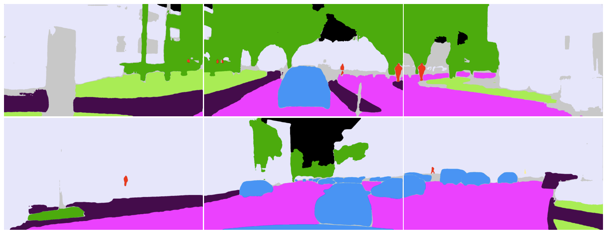
> Figure: Open-vocabulary semantic segmentation with OpenSeeD

#### Geometry
- TT-OccLiDAR directly uses the accurate but sparse geometry info from LiDAR.
- TT-OccCamera uses VGGT for **Depth Estimation** and **Triangulation-Based Scale Calibration**.

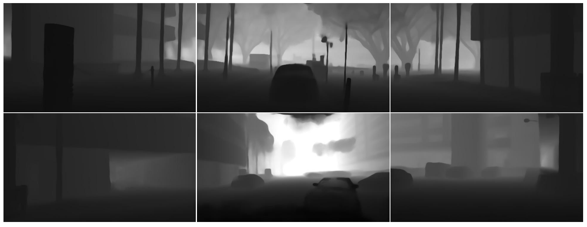
> Figure: We input six surrounding camera views into VGGT to generate per-view depth predictions (without metric scale).

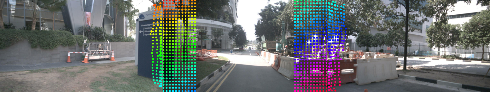
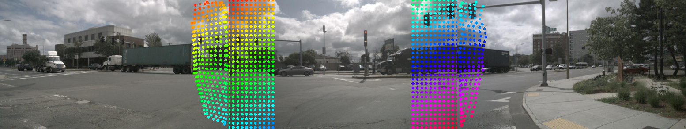
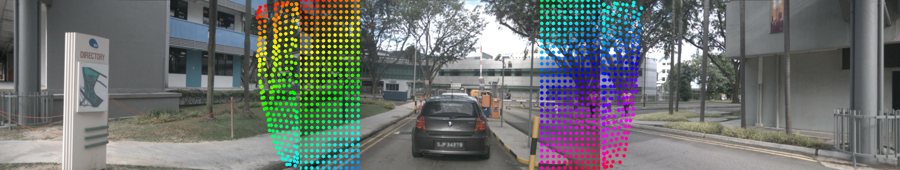
> Figure: We select three adjacent cameras including front, front-left, and front-right, and use VGGT to track sparse 2D keypoints across them.
Then, these matched 2D points are triangulated using the GT camera intrinsics and extrinsics provided by the dataset, resulting in a sparse but metrically accurate 3D point cloud.
Finally, we compare the magnitudes of the triangulated 3D points with those reconstructed from the predicted depth maps at the corresponding image locations, and compute a global scaling factor to align the depth predictions with real-world scale.

### 2. **Track** Dynamic Gaussians
- TT-OccLiDAR: Tracking with LiDAR
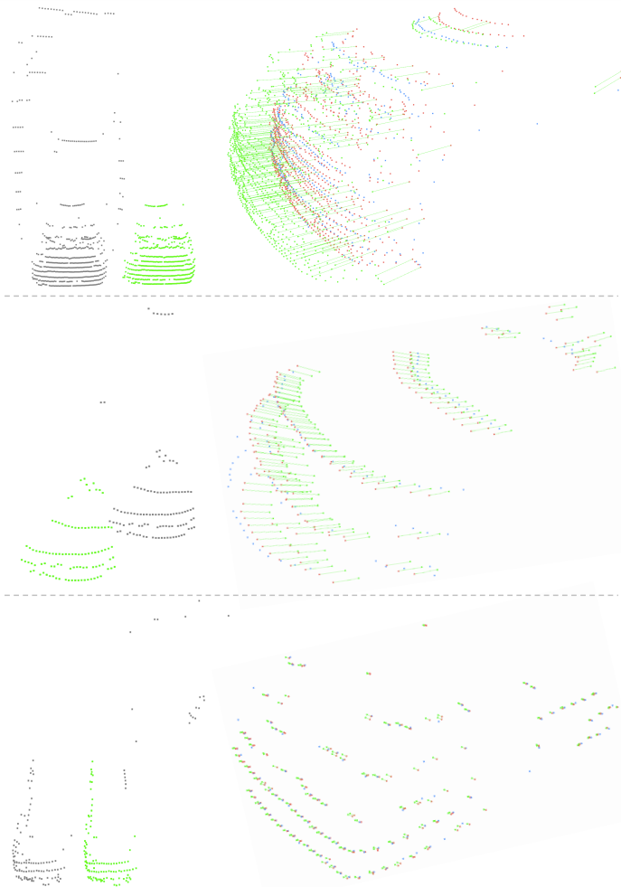
> Figure: Tracking in TT-OccLiDAR is generally more robust than in TT-OccCamera because LiDAR provides more accurate geometry. The process starts by optionally removing the ground plane from the point cloud to better isolate foreground objects. LiDAR points are then matched to object masks predicted by the segmentation model, although these masks can be imprecise. To improve reliability, a clustering algorithm is used to remove noise from each object’s points. The cleaned object clusters are then matched across frames based on their position and shape, and their motion is estimated using a standard alignment method. Only matched objects are carried forward, while unmatched ones are discarded to avoid errors from moving or disappearing objects. This approach results in reliable object-level tracking across frames.

- TT-OccCamera: Tracking with RAFT

> Figure: We use RAFT to estimate optical flow between adjacent frames and, together with camera poses and predicted depth, identify regions with dynamic motion. However, directly using these raw dynamic cues can introduce a lot of noise and instability due to errors in flow and depth estimation. To address this, we first use a simple threshold to select likely dynamic regions and then further refine these regions by leveraging semantic segmentation results from OpenSeeD. This refinement helps ensure that the dynamic masks align better with actual object boundaries and are less fragmented. Gaussians projected onto these dynamic regions are treated as dynamic and excluded from static accumulation in the following frame. While this approach does not allow for full modeling of dynamic objects as in the LiDAR-based method, it effectively reduces artifacts and improves temporal consistency by filtering out unreliable motion cues.

### 3. **Voxelize** Gaussians
To efficiently estimate occupancy, we convert the accumulated Gaussians into a structured grid of small volumetric units called voxels. Each voxel's occupancy probability is determined by considering the nearby Gaussians, with closer Gaussians contributing more significantly. This approach allows our system to flexibly adjust voxel resolutions at test-time, providing a good balance between efficiency and accuracy.

## Result
### Occ3D-nuScenes
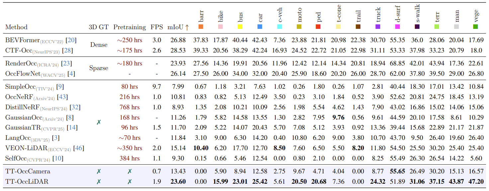
> Table: Our results on the Occ3D-nuScenes benchmark show that both versions of TT-Occ not only avoid the need for expensive offline training, but also outperform previous state-of-the-art methods. The LiDAR-based version achieves accuracy comparable to top supervised methods, while the camera-only version matches the performance of models trained with LiDAR supervision. TT-Occ also outperforms similar methods in detecting both common large objects and rare small or dynamic objects. Although some categories cannot be recognized due to label mismatches in the segmentation model, TT-Occ still achieves the best overall performance.

### nuCraft
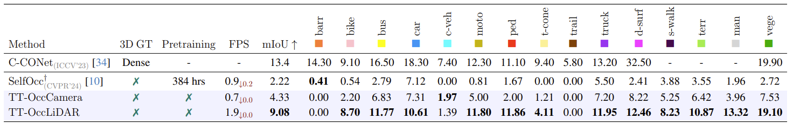
> Table: On the nuCraft dataset, TT-Occ is compared with SelfOcc and shows clear advantages in both accuracy and efficiency. While other methods become much slower as resolution increases, TT-Occ remains fast and consistent thanks to its lightweight approach to voxelization. This demonstrates TT-Occ’s superior adaptability and robustness, especially for high-resolution and challenging scenarios.

### Visual Comparison with SelfOcc
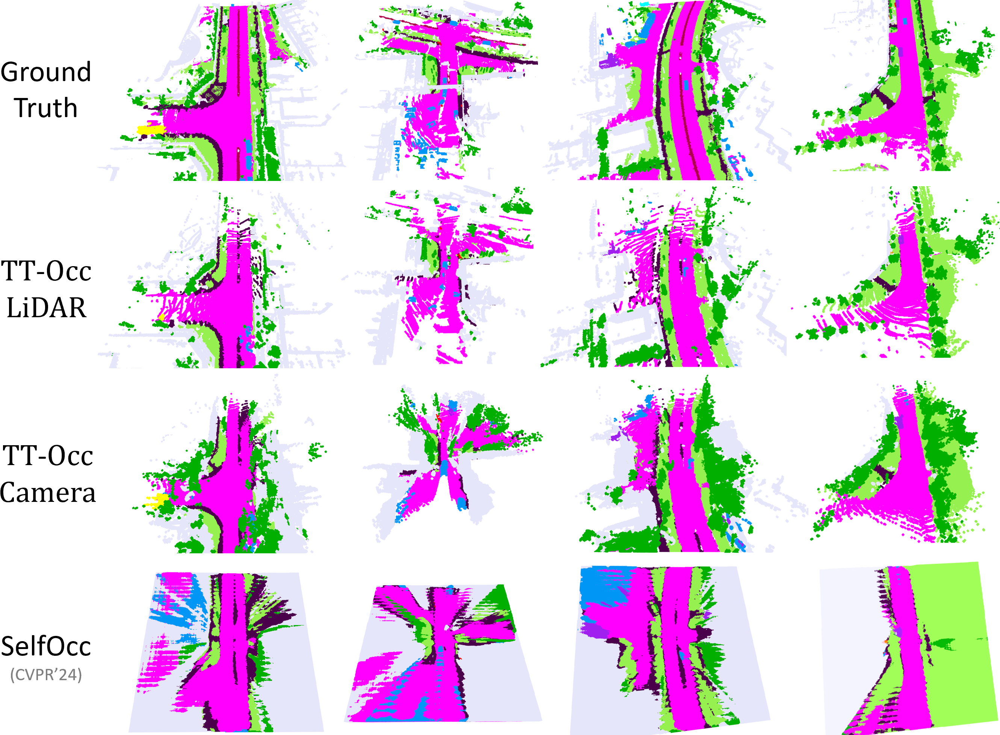
> Figure: Visual comparisons on nuCraft show that both TT-Occ variants generate accurate occupancy maps, while SelfOcc produces overly dense and less accurate results, especially around dynamic objects. The LiDAR-based TT-Occ captures geometry well but misses details on small objects due to data sparsity. The camera-based version is denser and better at capturing small objects but less accurate at long range. Overall, TT-Occ’s modular design allows it to remain strong and benefit from future improvements in segmentation and vision-language models.

### Open-Vocabulary
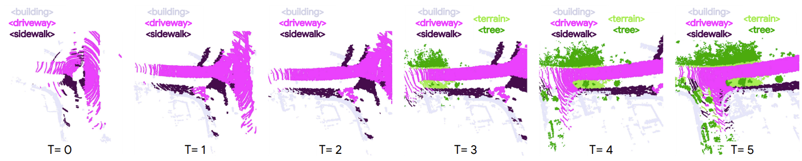
> Figure: TT-Occ inherently supports test-time adaptation to new semantic classes.
Since our method directly takes the semantic segmentation results from 2D VLM (OpenSeed) as input without training any network, it fully inherits the open-vocabulary capability of the VLM, enabling open-vocabulary occupancy prediction. 
Specifically, whenever a new semantic class beyond pre-defined classes is added to the VLM’s queries, our method can immediately incorporate the output into the occupancy map without any additional training or fine-tuning.  

### Ablation Study
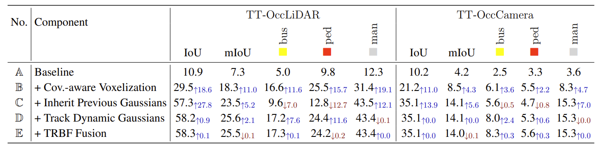
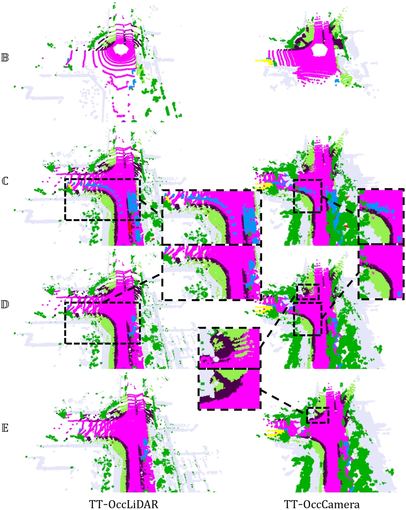
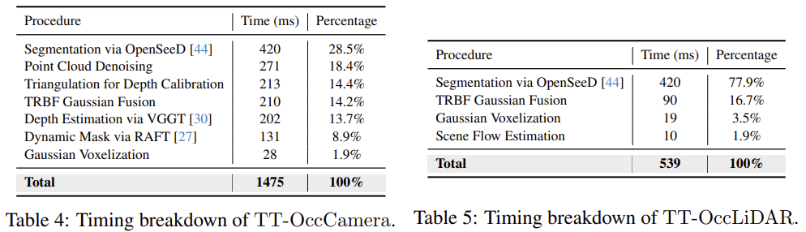